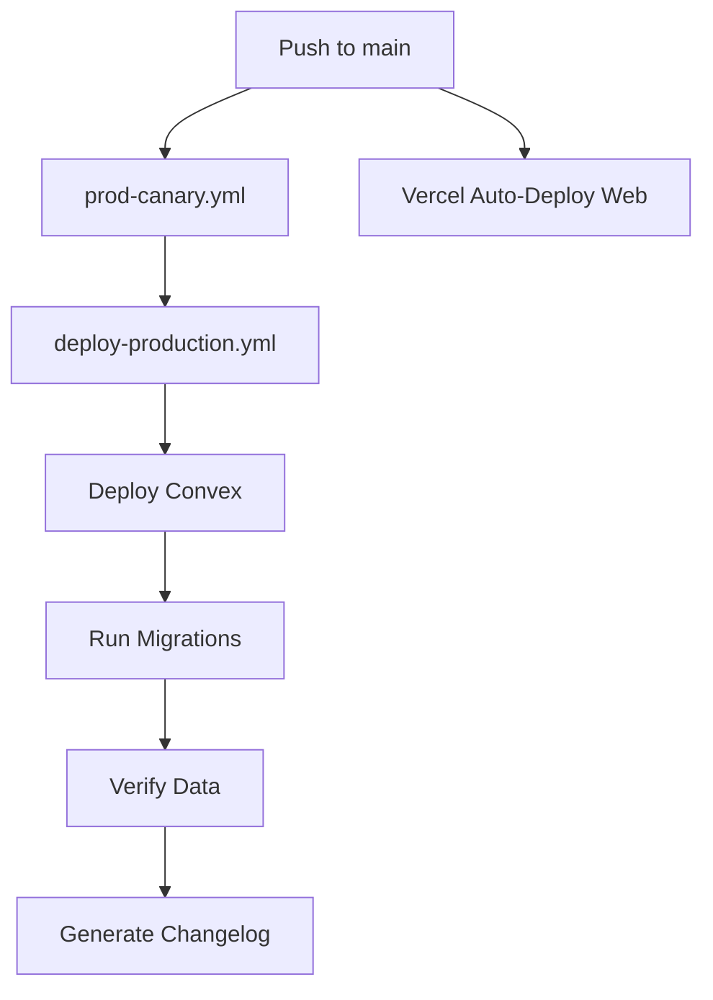

# GitHub Actions Workflows

This directory contains automated workflows for OpenChat's CI/CD pipeline.

## Workflows

### 1. Production Canary (`prod-canary.yml`)

**Trigger:** Push to `main` branch

**Purpose:** Runs health checks against production Convex deployment to verify it's operational before deploying.

**Key Steps:**
- Runs canary tests with retries and timeout handling
- Validates production environment connectivity
- Acts as a gatekeeper for production deployments

### 2. Production Deployment (`deploy-production.yml`)

**Trigger:** Push to `main` branch (after canary checks pass, including merges from PRs targeting `main`)

**Purpose:** Automatically deploys Convex backend to production on main branch merges.

**Key Steps:**
1. **Wait for Canary Checks** - Ensures production is healthy before deploying
2. **Configure Convex** - Sets up deployment configuration
3. **Deploy Convex** - Pushes schema and functions to production
4. **Verify Deployment** - Confirms successful deployment
5. **Run Migrations** - Executes database migrations automatically
6. **Verify Data** - Checks data consistency post-migration
7. **Generate Changelog** - Creates an AutoChangelog entry for the release

**Environment Variables:**
- `CONVEX_DEPLOY_KEY` - Required secret for Convex deployment authentication
- `AUTOCHANGELOG_WEBHOOK_URL` - Optional: AutoChangelog webhook URL
- `AUTOCHANGELOG_SECRET` - Optional: AutoChangelog signing secret (preferred)
- `AUTOCHANGELOG_WEBHOOK_SECRET` - Optional: Legacy secret name also supported

### 3. Claude Code (`claude.yml`)

**Trigger:** Issue/PR comments with `@claude` mention

**Purpose:** Allows Claude to assist with code reviews and tasks via GitHub comments.

## Setup Instructions

### Required GitHub Secrets

Add these secrets in your repository settings (`Settings > Secrets and variables > Actions`):

#### `CONVEX_DEPLOY_KEY`

This is the deploy key for your Convex production deployment.

**How to get it:**

1. Go to [Convex Dashboard](https://dashboard.convex.dev/)
2. Select your production deployment: `outgoing-setter-201`
3. Navigate to Settings > Deploy Keys
4. Generate or copy your deploy key
5. Add it to GitHub Secrets as `CONVEX_DEPLOY_KEY`

**Alternative:** If you already use this in Vercel:
1. Go to your Vercel project settings
2. Find the `CONVEX_DEPLOY_KEY` environment variable
3. Copy the value
4. Add it to GitHub Secrets

#### `AUTOCHANGELOG_WEBHOOK_URL` & `AUTOCHANGELOG_SECRET` (Optional, preferred)

These enable automatic changelog generation after each deployment via [AutoChangelog](https://autochangelog.com).

**How to get them:**

1. Go to [AutoChangelog Repositories](https://autochangelog.com/repositories)
2. Find your repository (opentech1/openchat)
3. Click "Installation Instructions"
4. Copy the **Webhook URL** → add as `AUTOCHANGELOG_WEBHOOK_URL`
5. Copy the **Webhook Secret** → add as `AUTOCHANGELOG_SECRET`

Legacy compatibility: `AUTOCHANGELOG_WEBHOOK_SECRET` is also supported if you already use that name.

The changelog will be auto-generated and published to [updates.osschat.dev](https://updates.osschat.dev/) after each successful deployment.

### Testing the Workflow

After setting up secrets, you can test the workflow:

1. **Trigger a deployment:**
   ```bash
   git checkout main
   git pull
   # Make a small change
   git commit -m "test: trigger deployment workflow"
   git push origin main
   ```

2. **Monitor the workflow:**
   - Go to your repository's Actions tab
   - Watch the "Production Canary" workflow
   - Then watch the "Deploy to Production" workflow
   - Check the logs for any errors

3. **Verify deployment:**
   - Visit [Convex Dashboard](https://dashboard.convex.dev/t/outgoing-setter-201)
   - Check deployment logs and function versions
   - Run: `bun run verify:prod` locally to verify health

## Manual Deployment

If you need to deploy manually (bypassing the workflow):

```bash
# Deploy Convex only
bun run deploy

# Deploy and run migrations
bun run deploy && bun run convex:migrate

# Verify data consistency
bun run convex:verify
```

## Migration Management

Migrations are automatically run as part of the deployment workflow. They are designed to be:

- **Idempotent** - Safe to run multiple times
- **Non-destructive** - Only add/update data, never delete
- **Skippable** - Already-migrated data is skipped

**Manual migration commands:**

```bash
# Run all pending migrations
bun run convex:migrate

# Verify data consistency only
bun run convex:verify

# Force re-run migrations
bun run convex:migrate --force
```

**Available migrations:**

1. `initializeStats` - Initialize database statistics counters
2. `backfillMessageCounts` - Backfill message count fields for existing chats
3. `verifyMessageCounts` - Verify data consistency (verification only)

## Troubleshooting

### Deployment Fails with "Invalid deploy key"

**Solution:**
1. Verify `CONVEX_DEPLOY_KEY` secret is set correctly
2. Check the key hasn't expired in Convex dashboard
3. Ensure you're using the key for the correct deployment (`outgoing-setter-201`)

### Canary Checks Fail Before Deployment

**Solution:**
1. Check production Convex deployment status
2. Review canary test logs in the workflow
3. Verify `CONVEX_URL` secret is set correctly
4. Wait for ongoing issues to resolve, workflow will retry

### Migration Fails

**Solution:**
1. Check migration logs in the workflow output
2. Verify deployment succeeded before migrations ran
3. Run migrations manually: `bun run convex:migrate`
4. If data is inconsistent, run: `cd apps/server && bunx convex run migrations:fixMessageCounts`

### Workflow Not Triggering

**Solution:**
1. Ensure you're pushing to the `main` branch
2. Check Actions tab is enabled for your repository
3. Verify workflow files are in `.github/workflows/` directory
4. Check GitHub Actions permissions in repository settings

## Workflow Dependencies



## Security Best Practices

1. **Never commit secrets** - Always use GitHub Secrets
2. **Rotate deploy keys** - Periodically update `CONVEX_DEPLOY_KEY`
3. **Review workflow changes** - Audit any changes to workflow files
4. **Monitor deployments** - Check Convex dashboard after each deployment
5. **Use protected branches** - Require PR reviews before merging to main

## Related Documentation

- [Convex Deployment Docs](https://docs.convex.dev/production/deployment)
- [GitHub Actions Documentation](https://docs.github.com/en/actions)
- [OpenChat Deployment Guide](../../docs/deployment.md)
